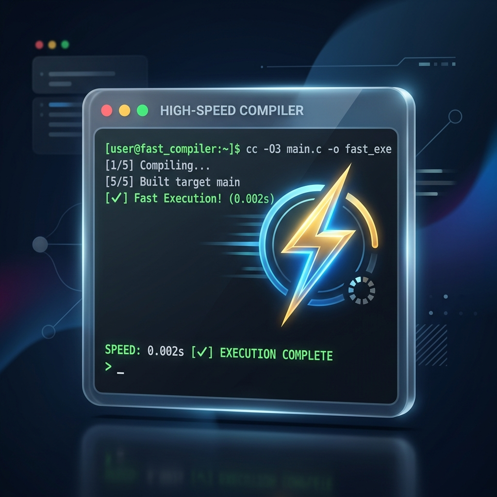
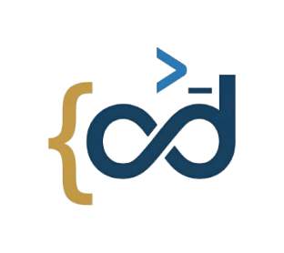

<!-- GITHUB HERO BANNER -->
<p align="center">
  
</p>

<p align="center">
  <h1 align="center">🚀 CodeZ | The Ultimate Online Code Compiler</h1>
</p>

<p align="center">
  <a href="https://github.com/ayushkumarjena15/Online-Code-Compiler">
    
  </a>
  <a href="https://github.com/ayushkumarjena15/Online-Code-Compiler/network/members">
    
  </a>
  <a href="https://github.com/ayushkumarjena15/Online-Code-Compiler/issues">
    
  </a>
  
</p>

<p align="center">
  <b>CodeZ</b> is a professional-grade, AI-powered online code compiler designed for developers who demand speed, style, and intelligence. Build, test, and share your code across multiple languages with a premium, glassmorphic interface and cutting-edge AI features.
</p>

---

## ✨ Features that Wow

### 🤖 Intelligence at its Core
<table width="100%">
  <tr>
    <td width="50%">
      
    </td>
    <td>
      <ul>
        <li><b>AI Bug Fixer:</b> One-click bug detection and fixing using Gemini AI.</li>
        <li><b>Interactive Tutor:</b> Step-by-step code explanations with text-to-speech support.</li>
        <li><b>Complexity Analysis:</b> Instantly get Time and Space complexity for your algorithms.</li>
        <li><b>Flowchart Visualization:</b> Convert your code logic into beautiful Mermaid.js diagrams.</li>
      </ul>
    </td>
  </tr>
</table>

### 🛠️ Developer-First Experience
<table width="100%">
  <tr>
    <td>
      <ul>
        <li><b>Monaco Editor:</b> The industry-standard editor with Vim mode and custom themes.</li>
        <li><b>Multi-Language:</b> Support for JavaScript, Python, Java, C++, SQL, and more.</li>
        <li><b>Web Playground:</b> Real-time HTML/CSS/JS preview for web developers.</li>
        <li><b>Interactive Terminal:</b> Full Xterm.js terminal with standard input support.</li>
      </ul>
    </td>
    <td width="50%">
      
    </td>
  </tr>
</table>

### 🏆 Gamified Learning
- **DSA Problems:** Solve curated data structures and algorithms challenges.
- **Leaderboard:** Compete with others and rise to the top.
- **Streaks:** Keep your coding momentum alive with daily activity tracking.
- **Certificates:** Earn and download professional certificates for your achievements.

---

## 🚀 Tech Stack

<p align="center">
  
  
  
  
  
</p>

---

## 🛠️ Getting Started

### Prerequisites

- **Node.js**: Ensure you have Node.js installed.
- **Supabase Account**: For database and authentication.
- **Gemini API Key**: For AI features.

### Installation

1. **Clone the repository:**
   ```bash
   git clone https://github.com/ayushkumarjena15/Online-Code-Compiler.git
   cd Online-Code-Compiler
   ```

2. **Install dependencies:**
   ```bash
   npm install
   ```

4. **Run the development server:**
   ```bash
   npm run dev
   ```

---

## 🎨 Design Philosophy

CodeZ follows a **Glassmorphic & Premium** design language.
- **Vibrant Gradients:** Tailored HSL palettes for a modern feel.
- **Micro-Animations:** Smooth transitions and hover effects.
- **Dark Mode First:** Optimized for long coding sessions.

---

## 🤝 Contributing

Contributions are what make the open-source community such an amazing place to learn, inspire, and create. Any contributions you make are **greatly appreciated**.

1. Fork the Project
2. Create your Feature Branch (`git checkout -b feature/AmazingFeature`)
3. Commit your Changes (`git commit -m 'Add some AmazingFeature'`)
4. Push to the Branch (`git push origin feature/AmazingFeature`)
5. Open a Pull Request

---

<p align="center">
  Built with ❤️ by <a href="https://github.com/ayushkumarjena15">Ayush Kumar Jena</a>
</p>

<p align="center">
  
</p>
